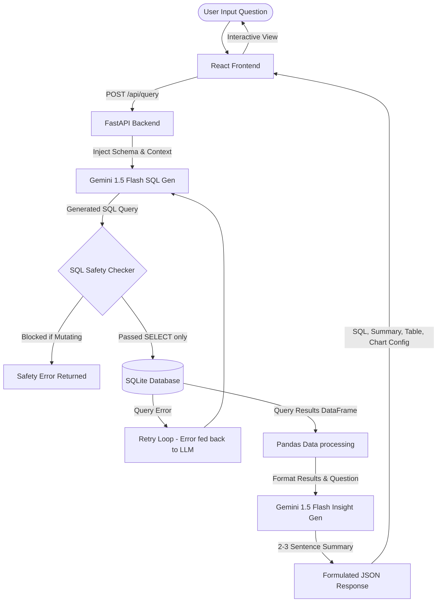

# Conversational Analytics Assistant 📊🤖

Conversational Analytics Assistant is an AI-powered business intelligence (BI) system that enables users to interact with structured corporate datasets using natural language. 

The system leverages Large Language Models (LLMs) to dynamically translate user questions into valid SQLite queries, execute them on a live relational database, and generate plain-English executive summaries alongside interactive data visualizations.

---

## Architecture Diagram

The system employs a client-server architecture. The user talks to a React frontend, which forwards the request to a FastAPI backend. The backend manages the text-to-SQL logic, runs the query against a local SQLite database containing standard IBM HR employee attrition data, and sends the query results back to the LLM to get natural language summaries.



---

## Key Features

1.  **Natural Language to SQL**: Converts plain-English queries (e.g. *"Show average salary by department"*) into executable SQLite syntax.
2.  **Logic Explanation & SQL Preview**: Transparently displays the generated SQL statement alongside a one-sentence breakdown explaining the database operations.
3.  **Self-Correction Retry Loop**: Automatically intercepts SQLite syntax errors, sending the error logs and SQL code back to Gemini to self-heal the query before returning the result.
4.  **SQL Safety Filter**: Evaluates generated SQL strings against a regex safety block. Rejects mutating statements (`DROP`, `DELETE`, `UPDATE`, `INSERT`, `ALTER`, etc.) to prevent database corruption.
5.  **Multi-Stage Loading State**: Animates the user experience through the background processing sequence (`Generating SQL...` -> `Executing Query...` -> `Summarizing Results...`).
6.  **Responsive Dashboard Visualizations**: Grouped queries dynamically display a Recharts Bar Chart, chronological data displays a Recharts Line Chart, and complex datasets fall back to a searchable tabular layout.
7.  **Fuzzy Search, Sorting & Pagination**: Table features instant search filtering, toggle-able column sorting (alphanumeric and integer-aware), and paginated rows.
8.  **Data Exporting**: Export query results directly to `.csv` spreadsheets with a single click.

---

## Tech Stack

| Component           | Technology / Libraries              |
| ------------------- | ----------------------------------- |
| **Frontend**        | React.js (Vite), Tailwind CSS v3, Recharts, Axios, Lucide Icons |
| **Backend**         | FastAPI, Uvicorn, Python-Dotenv, Pydantic |
| **Database**        | SQLite (embedded), Pandas |
| **LLM Provider**    | Gemini 1.5 Flash (via official `google-genai` SDK) |

---

## Dataset Schema

The system is seeded on startup with the standard **IBM HR Analytics Attrition & Performance Dataset** (1,470 records). 
Table name: `employees`

Key columns of interest:
*   `age` (INT)
*   `gender` (TEXT: `'Male'`, `'Female'`)
*   `department` (TEXT: `'Sales'`, `'Research & Development'`, `'Human Resources'`)
*   `job_role` (TEXT: `'Sales Executive'`, `'Research Scientist'`, `'Software Engineer'`, etc.)
*   `salary` (INT)
*   `monthly_income` (INT)
*   `attrition` (TEXT: `'Yes'`, `'No'`)
*   `overtime` (TEXT: `'Yes'`, `'No'`)
*   `years_at_company` (INT)
*   `performance_rating` (INT: `1` to `4`)
*   `work_life_balance` (INT: `1` to `4`)

---

## Installation & Setup

### Prerequisites
*   Python 3.10+
*   Node.js 18+
*   Gemini API Key (obtain from Google AI Studio)

### 1. Configure the Backend

1.  Navigate to the `backend` folder:
    ```bash
    cd backend
    ```
2.  Install dependencies:
    ```bash
    pip install -r requirements.txt
    ```
3.  Create a `.env` file in the `backend/` directory:
    ```env
    GEMINI_API_KEY=your_gemini_api_key_here
    ```
4.  Run the FastAPI application (it will automatically download the CSV and seed `analytics.db` on launch):
    ```bash
    python main.py
    ```
    *The API will be available at `http://localhost:8000`.*

### 2. Configure the Frontend

1.  Open a new terminal and navigate to the `frontend` folder:
    ```bash
    cd frontend
    ```
2.  Install packages:
    ```bash
    npm install
    ```
3.  Start the Vite dev server:
    ```bash
    npm run dev
    ```
    *The dashboard will be available at `http://localhost:5173` (or the terminal-provided local address).*

---

## API Documentation

### `POST /api/query`
Main endpoint for translating natural language questions into database insights.

**Request Payload:**
```json
{
  "question": "Compare monthly income across teams",
  "history": [
    {
      "question": "Which department has the highest attrition?",
      "sql_query": "SELECT department, COUNT(*) AS attrition_count FROM employees WHERE attrition = 'Yes' GROUP BY department ORDER BY attrition_count DESC;"
    }
  ]
}
```

**Response Payload:**
```json
{
  "success": true,
  "sql_query": "SELECT department, AVG(monthly_income) AS average_income FROM employees GROUP BY department ORDER BY average_income DESC;",
  "sql_explanation": "This query calculates the average monthly income for employees in each department, ordered from highest to lowest.",
  "summary": "Research & Development has the highest average monthly income at approximately $6,805, closely followed by Sales at $6,959. Human Resources has the lowest average monthly income at $6,654.",
  "columns": ["department", "average_income"],
  "results": [
    { "department": "Research & Development", "average_income": 6805.65 },
    { "department": "Sales", "average_income": 6959.12 },
    { "department": "Human Resources", "average_income": 6654.50 }
  ],
  "row_count": 3
}
```

### `GET /api/stats`
Returns general database metadata (total headcount, attrition rates, avg income, department count) to load into the dashboard KPI banner.

### `GET /api/logs`
Returns the execution history of the last 20 queries, including questions, SQL statements, and success/failure status.

---

## Example Queries to Demo

*   *Attrition Rates*: `"Compare attrition rate by department"`
*   *Income Demographics*: `"Show average monthly income by job role"`
*   *Overtime Analysis*: `"Which job roles work the most overtime?"`
*   *Company Tenure*: `"Show average years at company by department"`
*   *Fuzzy Search Filters*: `"Show details of Software Engineers aged over 40"`

---

## Deployment Steps

### Backend (Render)
1.  Push the project code to a GitHub repository.
2.  Log into Render and create a new **Web Service**.
3.  Connect your GitHub repository.
4.  Configure the service details:
    *   **Root Directory**: `backend` (or leave blank if repository is split/monorepo)
    *   **Build Command**: `pip install -r requirements.txt`
    *   **Start Command**: `python -m uvicorn main:app --host 0.0.0.0 --port $PORT`
5.  Add environment variables in the Render settings tab:
    *   `GEMINI_API_KEY`: `your_real_gemini_key`
6.  Click **Deploy Web Service**.

### Frontend (Vercel)
1.  Log into Vercel and import your GitHub repository.
2.  Configure the build settings:
    *   **Framework Preset**: `Vite`
    *   **Root Directory**: `frontend`
    *   **Build Command**: `npm run build`
    *   **Output Directory**: `dist`
3.  Add environment variables:
    *   `VITE_API_URL`: `https://your-backend-render-subdomain.onrender.com` (points to your deployed Render API)
4.  Click **Deploy**.
